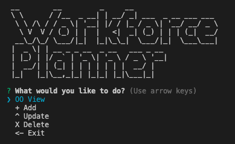
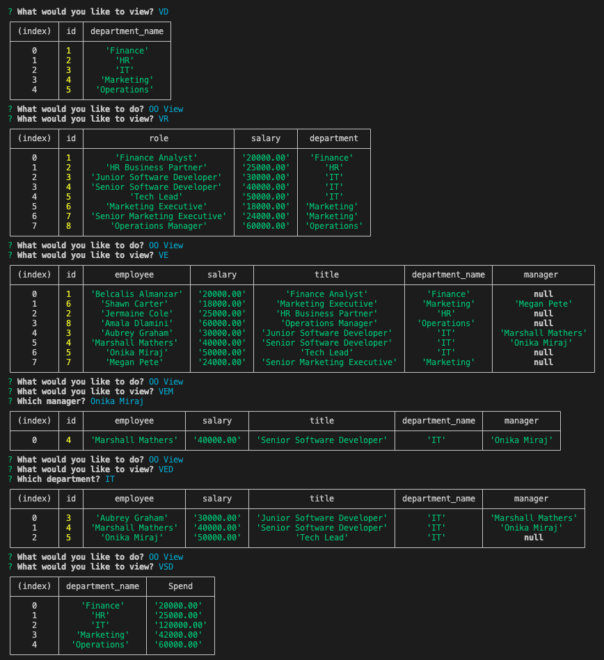
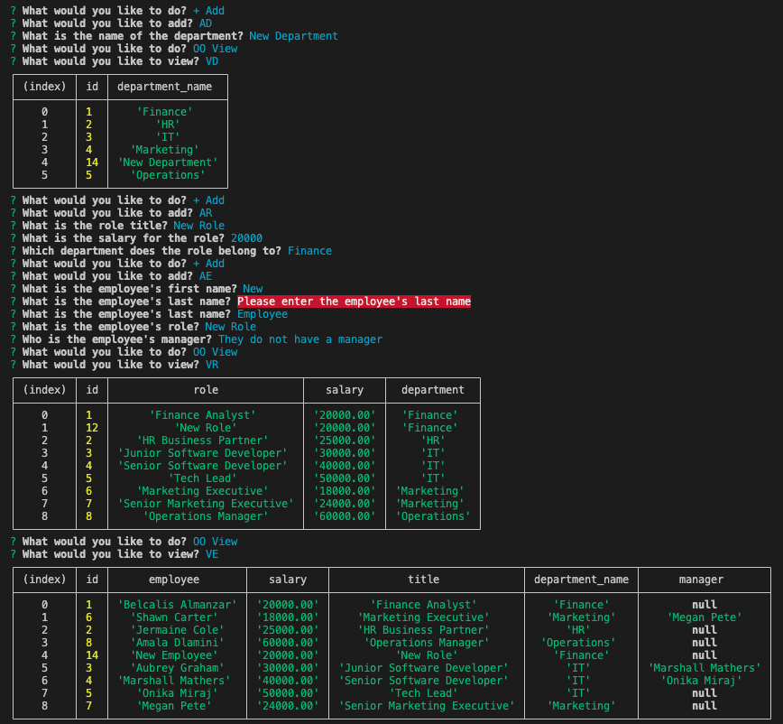
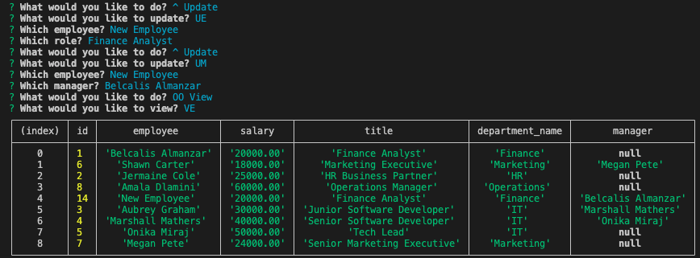
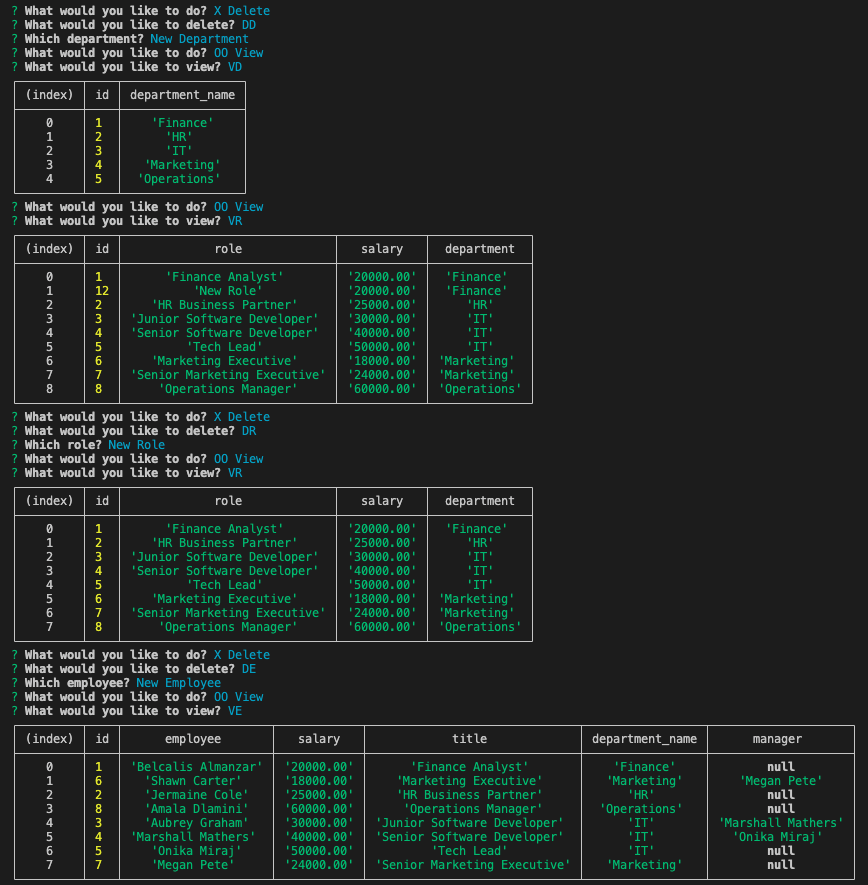

# workforce-planner 

Content Management System (CMS) using CLI to manage a company's employee database, using Node.js, Inquirer, and MySQL.

[Demo](https://drive.google.com/file/d/1eIAQ1se44oPhi-0MjxnWu9Bn-g4_2Jlm/view?usp=sharing)

## Technologies

- MySQL
- Inquirer
- Node
- Nodemon
- Figlet
- Chalk

## Screenshots

<details>
<summary>CLI User Journey - Top Menu</summary>



</details>

<details>
<summary>View Tables</summary>



</details>

<details>
<summary>Add Information</summary>



</details>

<details>
<summary>Update Information</summary>



</details>

<details>
<summary>Delete Information</summary>



</details>

<br>
## User Story

```md
AS A business owner
I WANT to be able to view and manage the departments, roles, and employees in my company
SO THAT I can organize and plan my business
```

## Acceptance Criteria

```md
GIVEN a command-line application that accepts user input
WHEN I start the application
THEN I am presented with the following options: view all departments, view all roles, view all employees, add a department, add a role, add an employee, and update an employee role
WHEN I choose to view all departments
THEN I am presented with a formatted table showing department names and department ids
WHEN I choose to view all roles
THEN I am presented with the job title, role id, the department that role belongs to, and the salary for that role
WHEN I choose to view all employees
THEN I am presented with a formatted table showing employee data, including employee ids, first names, last names, job titles, departments, salaries, and managers that the employees report to
WHEN I choose to add a department
THEN I am prompted to enter the name of the department and that department is added to the database
WHEN I choose to add a role
THEN I am prompted to enter the name, salary, and department for the role and that role is added to the database
WHEN I choose to add an employee
THEN I am prompted to enter the employee’s first name, last name, role, and manager, and that employee is added to the database
WHEN I choose to update an employee role
THEN I am prompted to select an employee to update and their new role and this information is updated in the database
```
